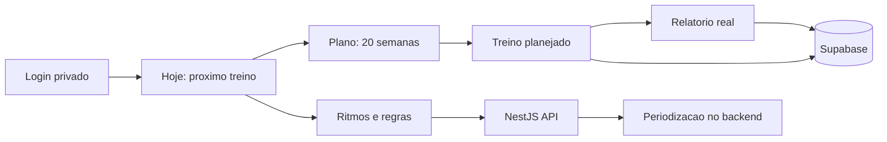

# MyPace

MyPace e um MVP pessoal para consultar a periodizacao de corrida do Guilherme em uma interface simples, privada e pronta para deploy.

O foco do projeto e direto: entrar, ver o proximo treino, consultar a semana atual, navegar pelas 20 semanas do ciclo, registrar execucao e revisar ritmos/regras importantes da preparacao para meia maratona.

## O Que O App Faz

- Login privado com Supabase Auth.
- Consulta da periodizacao gerada a partir do plano `periodizacao_meia_maratona_guilherme_com_ritmos.md`.
- Tela `Hoje` com proximo treino, semana atual e comentarios importantes.
- Tela `Plano` com todas as semanas, treinos, paces, distancias, RPE e orientacoes.
- Tela `Ritmos` com zonas de pace, cenarios de prova e regras do ciclo.
- Tela `Relatório` com métricas e gráfico usando somente treinos finalizados.
- Persistencia simples para marcar treinos como feitos e registrar km, pace, RPE e observacoes.

## Fluxo



## Stack

- Frontend: HTML, CSS e JavaScript puro em `public/`.
- Backend: NestJS + Express em `src/` e `api/`.
- Auth e persistencia: Supabase.
- Deploy: Vercel.
- Linguagem: TypeScript.

## Rodar Localmente

```bash
npm install
npm run dev
```

Acesse:

```text
http://localhost:3000
```

## Variaveis De Ambiente

Crie um `.env` local a partir do `.env.example`:

```bash
cp .env.example .env
```

Preencha:

```text
SUPABASE_URL=
SUPABASE_ANON_KEY=
SUPABASE_SERVICE_ROLE_KEY=
SEED_USERNAME=
SEED_USER_EMAIL=
SEED_USER_PASSWORD=
```

Nunca versionar `.env`, chaves privadas ou guias pessoais de deploy.

## Scripts

```bash
npm run dev
npm run build
npm start
npm run typecheck
npm run seed:user
```

## API

Documentacao dos endpoints: [docs/API.md](docs/API.md).

## Supabase

Schema principal: [supabase/schema.sql](supabase/schema.sql).

## Deploy Na Vercel

```text
Framework preset: Other
Build command: npm run build
Output directory: public
Install command: npm install
Node.js: 22.x
```

Configure as variaveis de ambiente na Vercel antes de publicar.
