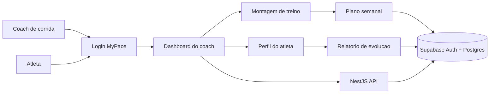

# MyPace

MyPace e um app web para coaches de corrida organizarem treinos, acompanharem pace e mostrarem evolucao de atletas com uma experiencia simples, moderna e profissional.

O produto foi pensado para quem treina corredores de forma recorrente: menos planilhas soltas, mais clareza sobre semana atual, carga, proximo treino, execucao e progresso.

## Proposta

- Dashboard do coach com visao rapida dos atletas acompanhados.
- Perfil do atleta com zonas, progresso semanal e indicadores de carga.
- Montagem de treino em timeline, com blocos de serie, pace alvo e intensidade.
- Relatorio de evolucao focado em pace, consistencia e aderencia.
- Login com Supabase Auth e persistencia do plano por usuario.
- Deploy simples na Vercel com frontend estatico e API serverless.

## Visao Do Produto



## Stack

- Frontend: HTML, CSS e JavaScript puro em `public/`.
- Backend: NestJS + Express em `src/` e `api/`.
- Banco e auth: Supabase Auth + Postgres.
- Deploy: Vercel.
- Linguagem: TypeScript.

## Rodar Localmente

```bash
npm install
npm run dev
```

Acesse:

```text
http://localhost:3000
```

Se precisar usar outra porta:

```bash
PORT=3001 npm run dev
```

## Variaveis De Ambiente

Crie um `.env` local a partir do `.env.example`:

```bash
cp .env.example .env
```

Preencha:

```text
SUPABASE_URL=
SUPABASE_ANON_KEY=
SUPABASE_SERVICE_ROLE_KEY=
SEED_USERNAME=
SEED_USER_EMAIL=
SEED_USER_PASSWORD=
```

Arquivos `.env`, guias privados e chaves ficam fora do Git por seguranca.

## Scripts

```bash
npm run dev
npm run build
npm start
npm run typecheck
npm run seed:user
```

## API

A documentacao dos endpoints esta em [docs/API.md](docs/API.md).

## Design

As diretrizes de interface, tokens e telas principais estao em [docs/DESIGN.md](docs/DESIGN.md).

## Supabase

O schema principal fica em [supabase/schema.sql](supabase/schema.sql). Estados locais, arquivos temporarios, seeds locais e variaveis privadas do Supabase sao ignorados no Git.

## Deploy Na Vercel

Configuracao recomendada:

```text
Framework preset: Other
Build command: npm run build
Output directory: public
Install command: npm install
Node.js: 22.x
```

Depois, cadastre as variaveis de ambiente no painel da Vercel e rode o deploy conectado ao GitHub.
