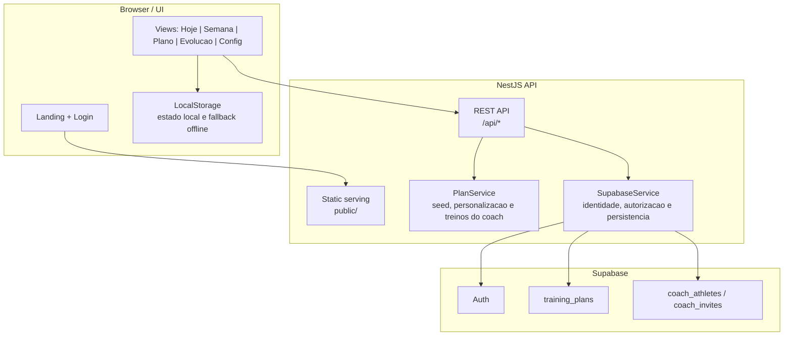
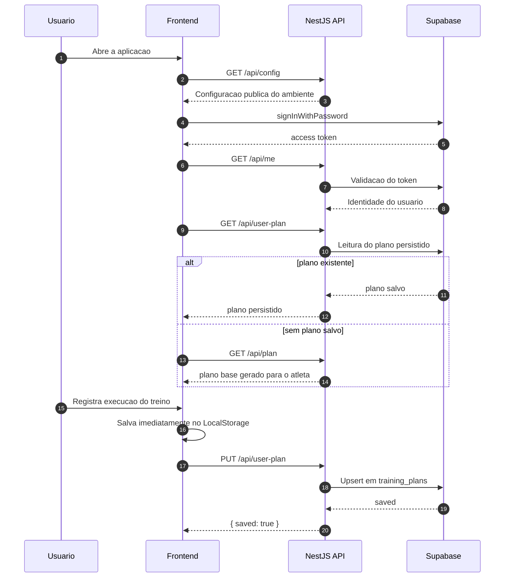
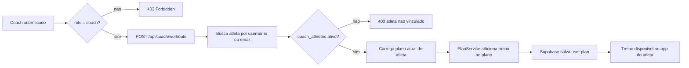

# MyPace

MyPace e uma aplicacao web para planejamento, acompanhamento e registro de treinos de corrida. O projeto combina um frontend estatico em React 18 via UMD, uma API NestJS e integracao com Supabase para autenticacao, identificacao de atletas e persistencia de planos.

O sistema foi desenhado para uma operacao simples em producao: a interface e servida a partir de `public/`, a API responde em `/api` e o estado do atleta pode continuar funcionando localmente mesmo quando a sincronizacao com a nuvem nao estiver disponivel.

## Visao Geral

- Periodizacao automatica por atleta autenticado.
- Registro de execucao com status, pace, RPE, observacoes e metricas reais.
- Navegacao focada em `Hoje`, `Semana`, `Plano`, `Evolucao` e `Config`.
- Persistencia local com sincronizacao assicrona para Supabase.
- Suporte a operacao de coach para criacao de treinos e relacionamento com atletas.
- Estrutura pronta para deploy em Vercel com Node.js 22.

## Arquitetura



## Fluxo Principal



## Fluxo De Coach



## Capacidades Do Produto

| Area | O que o sistema entrega |
| --- | --- |
| Planejamento | Gera periodizacoes base por identidade do atleta, incluindo variacoes especificas como o plano do Felipe. |
| Execucao | Permite registrar treino concluido, perdido, parcial ou substituido com detalhes de sensacao, dor, sono e observacoes. |
| Evolucao | Consolida historico executado para apoiar leitura de consistencia e progresso. |
| Persistencia | Usa LocalStorage para resiliencia no cliente e Supabase para sincronizacao em nuvem. |
| Coach | Lista atletas, cria convites e injeta treinos personalizados para atletas vinculados. |
| Deploy | Serve frontend estatico e API no mesmo projeto, simplificando publicacao na Vercel. |

## Stack Tecnico

| Camada | Tecnologia |
| --- | --- |
| Frontend | React 18 UMD + JavaScript em [`public/`](public/) |
| Backend | NestJS 11 + Express 5 em [`src/`](src/) |
| Persistencia | Supabase Auth + REST API |
| Tipagem | TypeScript 5 |
| Build | `tsc` |
| Runtime | Node.js 22.x |
| Deploy alvo | Vercel |

## Estrutura Do Repositorio

```text
.
|-- public/              # interface web servida estaticamente
|-- src/                 # modulos NestJS, controllers e services
|-- supabase/            # schema SQL base
|-- docs/                # documentacao complementar
|-- api/                 # assets auxiliares para ambiente serverless
|-- dist/                # build TypeScript
|-- README.md
|-- package.json
`-- vercel.json
```

Arquivos de referencia:

- [`src/plan.controller.ts`](src/plan.controller.ts): superficie HTTP da aplicacao.
- [`src/plan.service.ts`](src/plan.service.ts): geracao e mutacao dos planos.
- [`src/supabase.service.ts`](src/supabase.service.ts): autenticacao, autorizacao e persistencia.
- [`supabase/schema.sql`](supabase/schema.sql): schema base da tabela `training_plans`.

## Como Rodar Localmente

### 1. Instalar dependencias

```bash
npm install
```

### 2. Configurar ambiente

```bash
cp .env.example .env
```

Preencha as variaveis:

| Variavel | Uso |
| --- | --- |
| `SUPABASE_URL` | URL do projeto Supabase |
| `SUPABASE_ANON_KEY` | chave publica usada pelo frontend |
| `SUPABASE_SERVICE_ROLE_KEY` | chave privada usada pela API para persistencia e operacoes administrativas |
| `SEED_USERNAME` | usuario padrao para scripts de seed |
| `SEED_USER_EMAIL` | email padrao para scripts de seed |
| `SEED_USER_PASSWORD` | senha padrao para scripts de seed |
| `PORT` | porta HTTP da aplicacao |

### 3. Subir a aplicacao

```bash
npm run dev
```

Ambiente local padrao:

```text
http://localhost:3000
```

Observacao: o script `dev` faz `build` e inicia a API, mas nao roda em watch mode.

## Scripts

| Script | Finalidade |
| --- | --- |
| `npm run build` | compila TypeScript para `dist/` |
| `npm run dev` | compila e inicia a aplicacao localmente |
| `npm start` | inicia a build ja gerada |
| `npm run typecheck` | valida tipagem sem emitir arquivos |
| `npm run vercel-build` | comando de build para deploy |
| `npm run seed:user` | executa seed de usuario, quando o script local correspondente estiver presente |
| `npm run seed:felipe` | executa seed do usuario Felipe, quando o script local correspondente estiver presente |

## API

Base local:

```text
http://localhost:3000/api
```

Endpoints principais:

| Metodo | Rota | Descricao |
| --- | --- | --- |
| `GET` | `/health` | health check da aplicacao |
| `GET` | `/config` | configuracao publica consumida pelo frontend |
| `GET` | `/plan` | plano base do usuario autenticado |
| `GET` | `/me` | identidade resolvida a partir do token |
| `GET` | `/user-plan` | plano persistido do usuario |
| `PUT` | `/user-plan` | salva o plano do usuario |
| `GET` | `/coach/athletes` | lista atletas vinculados ao coach |
| `POST` | `/coach/invites` | cria convite para atleta |
| `POST` | `/coach/workouts` | adiciona treino ao plano de um atleta |

Documentacao complementar: [`docs/API.md`](docs/API.md).

## Persistencia E Supabase

O schema versionado neste repositorio cobre a tabela `training_plans` e a trigger de `updated_at`. Para recursos de coach, o ambiente Supabase tambem precisa disponibilizar tabelas compativeis com `coach_athletes` e `coach_invites`, usadas pelos endpoints administrativos.

Fluxo de persistencia:

1. O frontend salva alteracoes imediatamente no navegador.
2. Quando ha sessao valida e persistencia habilitada, a interface sincroniza o plano via `PUT /api/user-plan`.
3. A API executa `upsert` em `training_plans` usando a `service role key`.

Schema base: [`supabase/schema.sql`](supabase/schema.sql).

## Deploy Na Vercel

Configuracao recomendada:

```text
Framework preset: Other
Build command: npm run build
Output directory: public
Install command: npm install
Node.js: 22.x
```

Checklist de publicacao:

1. Configurar todas as variaveis de ambiente da aplicacao.
2. Garantir que o projeto Supabase tenha `training_plans` e, se necessario, as tabelas de coach.
3. Validar que o build gera `dist/src/main.js`.
4. Testar `/api/health` apos o deploy.

## Seguranca E Operacao

- Nunca versione `.env`, chaves privadas ou credenciais do Supabase.
- `SUPABASE_SERVICE_ROLE_KEY` deve permanecer exclusivamente no backend.
- Recursos de coach dependem de `role = coach` no perfil autenticado.
- O frontend foi desenhado com fallback local para reduzir perda de dados em cenarios de falha de rede.
